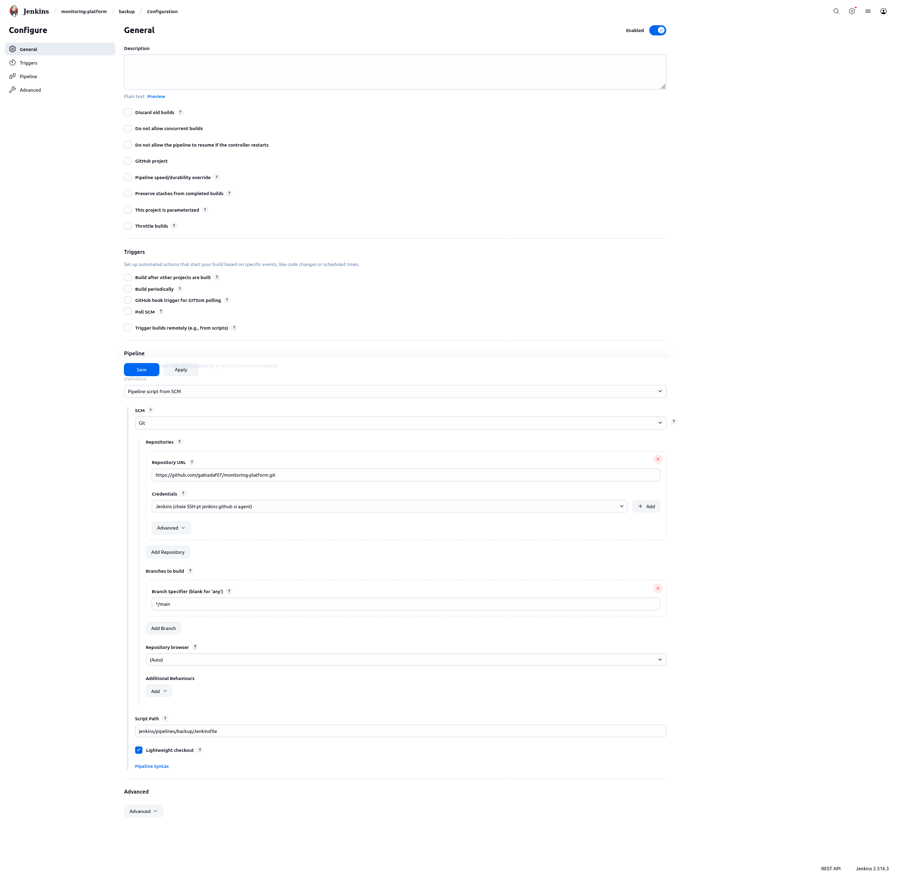
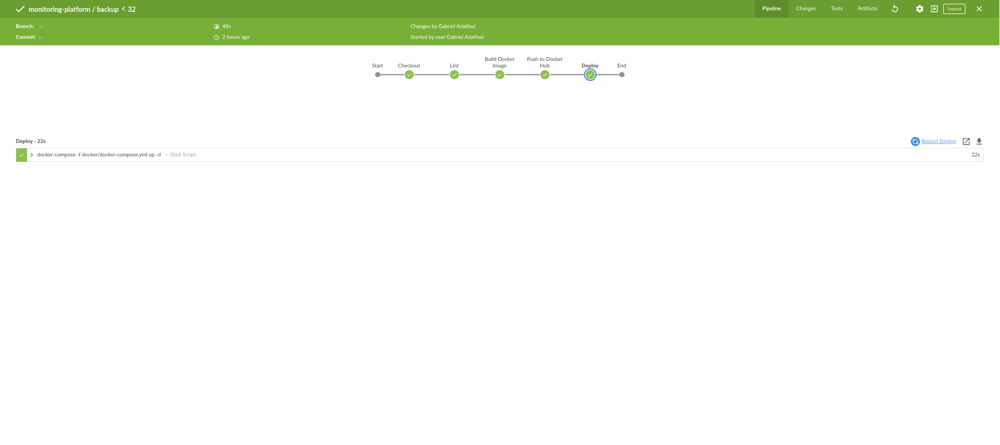
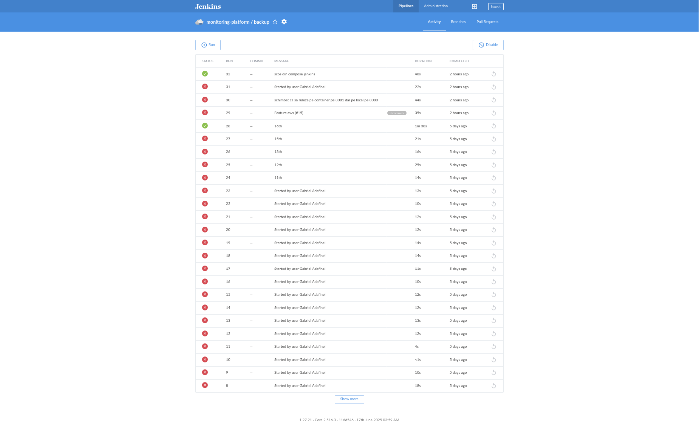
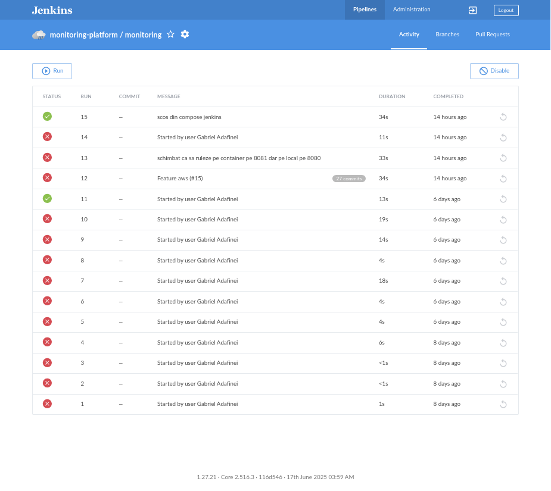
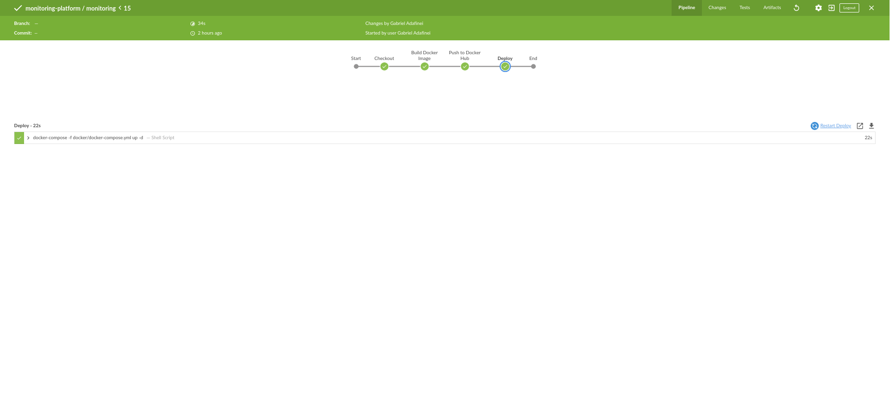

# 🖥️ Platforma de Monitorizare a Stării unui Sistem

## 📘 Scopul proiectului
Acest proiect reprezintă o **platformă de monitorizare** ce permite supravegherea sistemelor și utilizarea eficientă a resurselor hardware.  
Scopul principal este **maximizarea duratei de funcționare a aplicațiilor** și reducerea perioadelor de downtime.

---

## 🏗️ Arhitectura proiectului
*(Secțiune opțională – bonus)*

Puteți desena arhitectura generală a proiectului în Excalidraw, Lucidchart sau orice alt tool, și include imaginea în acest director:

```md

```

---

## 📂 Structura proiectului

### `/scripts`
Conține scripturile utilizate în proiect:
- `backup.py` – script Python responsabil de realizarea backup-urilor automate.  
- `monitoring.sh` – script Bash care monitorizează resursele sistemului.

### `/docker`
Include fișierele de configurare Docker:
- **Dockerfile (backup)** – definește imaginea pentru serviciul de backup.  
- **Dockerfile (monitoring)** – definește imaginea pentru serviciul de monitorizare.  
- **docker-compose.yml** – orchestrează toate serviciile platformei (backup, monitoring, nginx).  
- **Dockerfile (jenkins)** – definește containerul Jenkins pentru rularea pipeline-urilor.

### `/ansible`
Conține playbook-urile și fișierele de configurare pentru automatizare:
- `install_docker.yml` – instalează și configurează Docker pe o mașină remote.  
- `deploy_platform.yml` – lansează aplicația utilizând Docker Compose.  
- `inventory.ini` – lista mașinilor gestionate de Ansible.

### `/jenkins/pipelines`
Include pipeline-urile CI/CD:
- `backup/Jenkinsfile` – rulează etapele de lint, build, push și deploy pentru aplicația de backup.  
- `monitoring/Jenkinsfile` – rulează etapele de lint, build, push și deploy pentru aplicația de monitorizare.

### `/terraform`
Conține fișierele de configurare Terraform:
- `main.tf` – definește resursele infrastructurii (EC2, S3, Security Groups, etc.).  
- `backend.tf` – configurează backend-ul pentru stocarea fișierului `terraform.tfstate`.  
- `variables.tf` – declară variabilele parametrizabile (AMI ID, region, instance_type etc.).  
- `outputs.tf` – definește output-urile afișate după rularea `terraform apply`.  
- `versions.tf` – specifică versiunea minimă de Terraform necesară.

---

## ⚙️ Setup și rulare

### 🔧 Dependențe necesare
```bash
# Terraform
sudo apt update && sudo apt install -y terraform

# Ansible
sudo apt install -y ansible

# Docker & Docker Compose
sudo apt install -y docker.io
sudo curl -L "https://github.com/docker/compose/releases/download/v2.24.5/docker-compose-linux-x86_64" -o /usr/local/bin/docker-compose
sudo chmod +x /usr/local/bin/docker-compose

# Python (pentru scripturi)
sudo apt install -y python3 python3-pip
```

---
## Setup minikube

```bash
# 1. Instalează curl (dacă nu e deja instalat)
sudo apt update && sudo apt install -y curl

# 2. Descarcă Minikube
curl -LO https://storage.googleapis.com/minikube/releases/latest/minikube-linux-amd64

# 3. Instalează Minikube
sudo install minikube-linux-amd64 /usr/local/bin/minikube

# 4. Pornește Minikube cu driverul Docker (dacă Docker e instalat)
minikube start --driver=docker

# 5. Verifică statusul
minikube status
kubectl get nodes

# 6. Oprește sau șterge Minikube (opțional)
minikube stop
minikube delete
```

### 🔐 Generare cheie SSH
```bash
ssh-keygen -t rsa -f ~/.ssh/ansible_key
cat ~/.ssh/ansible_key.pub
```

### 🖥️ Configurare mașină remote
Instalați serviciul SSH:
```bash
su -
apt update
apt install -y openssh-server
systemctl status ssh
```

Adăugați un user nou:
```bash
adduser theansible
su - theansible
mkdir ~/.ssh
echo "CHEIA_PUBLICA_GENERATA" >> ~/.ssh/authorized_keys
chmod -R go= ~/.ssh
ls -ld ~/.ssh
```

---

### 🌐 Conectare între mașini
1. Configurați **network bridge** între cele două mașini virtuale (Ubuntu).  
2. Verificați IP-ul mașinii remote:
   ```bash
   ip addr
   ```
3. Testați conexiunea SSH:
   ```bash
   ssh -i ~/.ssh/ansible_key theansible@<ip_remote>
   ```

---

### 🧩 Configurare Ansible
Exemplu de fișier `inventory.ini`:
```ini
[dockerhost]
54.214.59.124 ansible_user=theansible ansible_ssh_private_key_file=~/.ssh/ansible_key
```

Rulați playbook-urile:
```bash
ansible-playbook -i inventory.ini install_docker.yml
ansible-playbook -i inventory.ini deploy_platform.yml
```

Verificați instalarea:
```bash
docker ps
docker logs <container_name>
```

---

## ☸️ Setup și rulare în Kubernetes

    # Docker & Docker Compose
    sudo apt install -y docker.io
    sudo curl -L "https://github.com/docker/compose/releases/download/v2.24.5/docker-compose-linux-x86_64" -o /usr/local/bin/docker-compose
    sudo chmod +x /usr/local/bin/docker-compose

    # Python (pentru scripturi)
    sudo apt install -y python3 python3-pip
    ```

```bash
#!/bin/bash
set -e

# 1. Activăm mediul Docker din Minikube
eval $(minikube docker-env)

# 2. Construim imaginile
docker build -t local/backup:latest -f docker/backup/Dockerfile .
docker build -t local/monitoring:latest -f docker/monitoring/Dockerfile .

# 3. Aplicăm manifestele
kubectl apply -f k8s/deployment.yaml
kubectl apply -f k8s/nginx-service.yaml
kubectl apply -f k8s/hpa.yaml

# 4. Verificăm statusul
kubectl get pods -n monitoring
kubectl get svc -n monitoring
kubectl get hpa -n monitoring


```
**Rulare minikube**
```bash
minikube service nginx-service -n monitoring --url
```

---

## 🚀 CI/CD și Automatizări (Jenkins)

1. **Creare view si folder**
```md

```


### 📦 Etape pipeline `backup`
1. **Checkout** – preia codul din GitHub.  
2. **Lint** – rulează `flake8` pe toate fișierele `.py`.  
3. **Build Docker Image** – construiește imaginea `gabiadaf07/backup:latest`.  
4. **Push to Docker Hub** – publică imaginea în Docker Hub.  
5. **Deploy** – rulează `docker-compose` pentru lansarea aplicației.

**Variabile de mediu:**
```groovy
environment {
    DOCKER_IMAGE = 'gabiadaf07/backup:latest'
    DOCKER_CREDENTIALS_ID = 'credentiale-dockerhub'
}
```



---
**Rulare blue ocean**







### 📊 Etape pipeline `monitoring`
1. **Checkout** – preia codul sursă.  
2. **Lint** – rulează `flake8` pe fișierele Python.  
3. **Build & Push** – construiește și publică imaginea Docker.  
4. **Deploy** – rulează serviciul în Docker Compose.

**Variabile de mediu:**
```groovy
environment {
    DOCKER_IMAGE = 'gabiadaf07/monitoring:latest'
    DOCKER_CREDENTIALS_ID = 'credentiale-dockerhub'
}
```



---
**Rulare blue ocean**



---

## ☁️ Terraform și AWS / LocalStack

### 1. Configurare AWS CLI
```bash
aws configure
# Access Key ID: test
# Secret Access Key: test
# Region: us-east-1
# Output format: json
```

### 2. Creare bucket S3 în LocalStack
```bash
aws --endpoint-url=http://localhost:4566 s3 mb s3://terraform-state-dev
```

### 3. Inițializare Terraform
```bash
terraform init
terraform validate
terraform plan
terraform apply
terraform output
```

---

## 📸 Documentație suplimentară
- Includeți capturi de ecran din Jenkins Blue Ocean pentru fiecare pipeline.  
- Prezentați cum a fost creat userul Jenkins dedicat proiectului.  
- Dacă ați implementat și partea de Kubernetes (bonus), includeți și setup-ul Minikube.

---

## ✅ Concluzie
Proiectul **Monitoring Platform** integrează:
- Automatizare completă CI/CD prin **Jenkins**
- Deploy automat prin **Ansible**
- Orchestrare prin **Docker Compose** și **Kubernetes**
- Infrastructură gestionată cu **Terraform**
